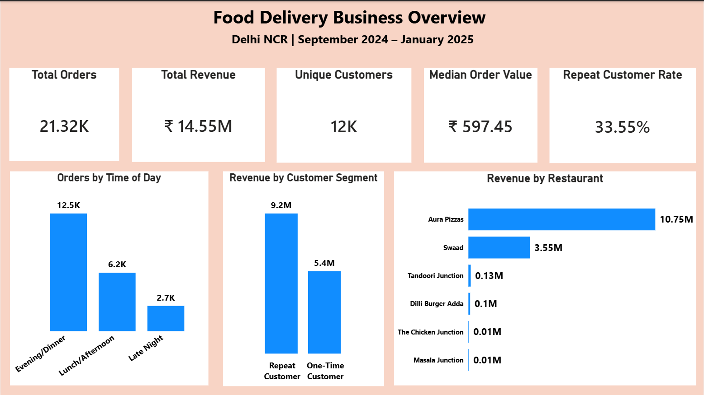
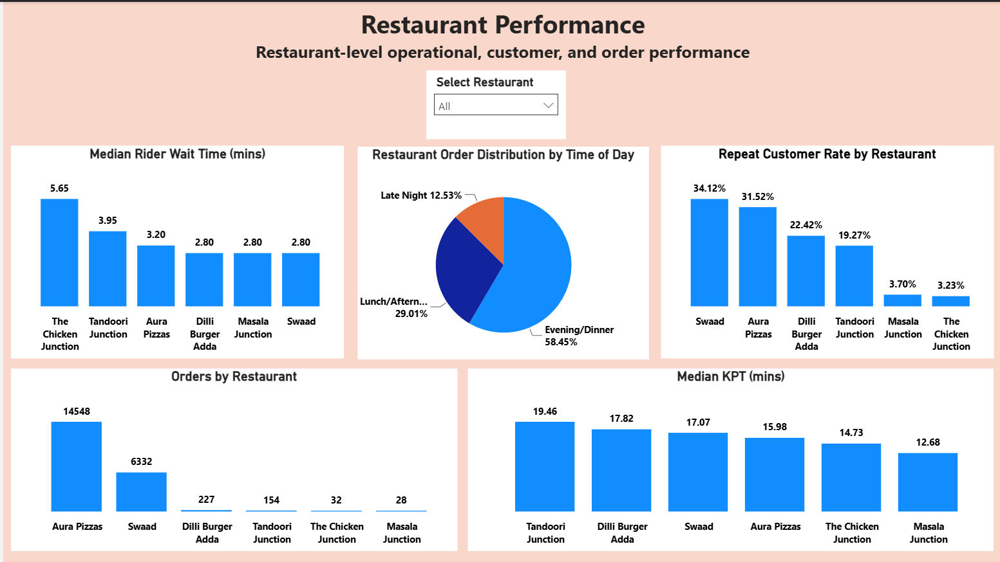
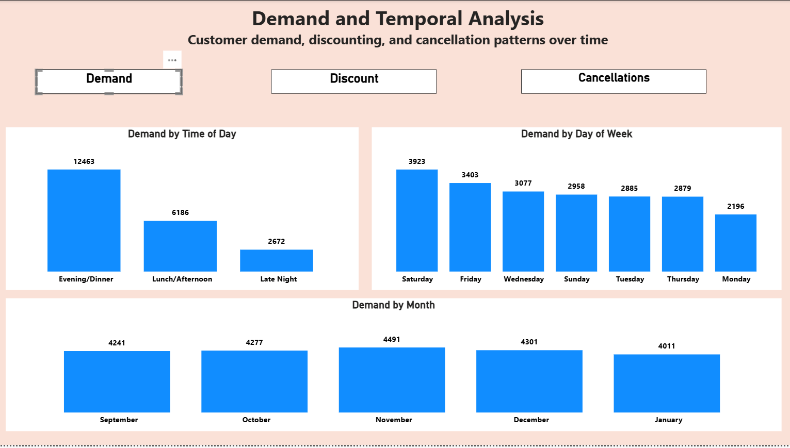
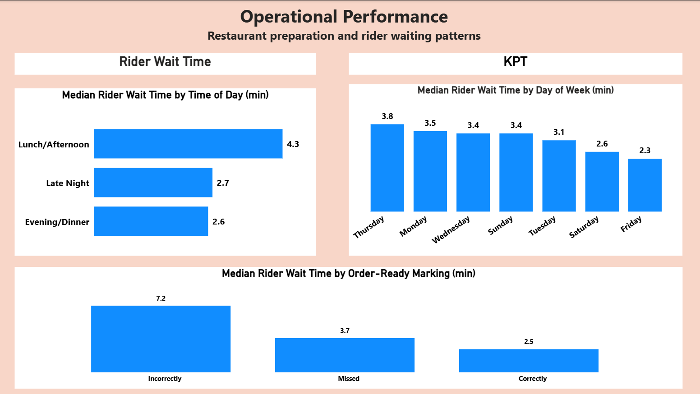
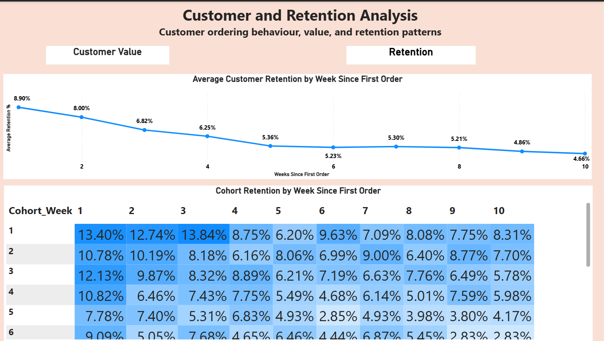

# Food Delivery Business Analytics

## 1.) Project Overview

This project is an end-to-end business analytics case study based on food delivery order data from September 2024 to January 2025.

The goal was to understand how the business is performing across **demand, restaurants, customers, discounts, cancellations, and operational performance**, and then turn those 
findings into practical business recommendations.

The analysis goes beyond basic exploratory data analysis. It combines **Python-based data analysis, statistical validation, driver analysis, and an interactive Power BI 
dashboard** to identify patterns that can help the business make better decisions around customer retention, restaurant performance, demand management, and operations.

The final project includes the complete analysis, supporting statistical work, business recommendations, and a Power BI dashboard that brings the key findings together in an 
interactive format.

## 2.) Business Problem

A food delivery platform handles a large number of orders across different customers, restaurants, and time periods. Looking at overall order and revenue numbers alone does 
not explain what is driving the business or where improvements are needed.

This project focuses on understanding the business through a few key questions :

- When is customer demand highest, and how does it change over time ?
- Which restaurants contribute most to orders and order value ?
- How do one-time and repeat customers differ in their contribution to the business ?
- How does customer retention change after the first order ?
- How do discounts and cancellations vary across different customer and demand segments ?
- What operational factors are associated with rider waiting time and kitchen preparation time ?

The aim is not just to describe these patterns, but to validate important relationships statistically, identify the key drivers and translate the findings into practical 
business recommendations.

## 3.) Analytical Approach

The project follows a business-first approach rather than stopping at basic data exploration.

The analysis was carried out in the following stages:

1. **Data Understanding** – Reviewed the dataset structure, variables, order patterns, customers, restaurants, and operational fields.
2. **Data Quality Assessment** – Checked missing values, duplicates, inconsistent values, and fields that were not useful for the analysis.
3. **Data Cleaning & Preparation** – Cleaned the relevant fields and created additional variables needed for the business analysis.
4. **Exploratory Analysis** – Studied demand, customer behaviour, restaurant performance, discounts, cancellations, and operational patterns.
5. **Statistical Validation** – Used statistical tests to check whether important differences and relationships observed in the data were statistically meaningful.
6. **Driver Analysis** – Investigated the factors associated with key business outcomes such as cancellations, rider wait time, and customer retention.
7. **Business Recommendations** – Converted the findings into practical recommendations based on both the evidence and their potential business impact.
8. **Power BI Dashboard** – Built an interactive dashboard to make the main findings easier to explore and communicate.

## 4.) Key Business Findings

The analysis highlighted several important patterns across customers, demand, restaurants, and operations:

- **Demand is concentrated around Evening / Dinner**, making peak-period operations especially important for the business.
- **Customer retention drops sharply after the first week**, showing that retaining customers beyond the initial order is a major opportunity.
- **A relatively small share of customers reaches higher order stages**, while customers who continue ordering contribute additional order value over their customer journey.
- **Rider wait time varies across operational conditions**, with order-ready marking status showing a notable difference in median waiting time.
- **Kitchen preparation time and rider wait time vary across different periods of the day**, pointing to opportunities for better coordination during busy periods.
- **Cancellation patterns differ across customer and operational segments**, suggesting that cancellations should be investigated rather than treated as a single
- overall problem.
- **Restaurant performance is not uniform**, with differences in order volume, customer repeat behaviour, and operational performance across restaurants.

These findings were used as the starting point for statistical testing, driver analysis, and the final business recommendations.

## 5.) Power BI Dashboard

The Power BI dashboard brings the main findings from the analysis into one place and allows the business to explore them interactively.

The dashboard is divided into five main areas:

- **Business Overview** – Provides a quick view of overall orders, revenue, customers, order value, and customer behaviour.
- **Restaurant Performance** – Compares restaurants based on order volume, customer repeat behaviour, and operational performance.
- **Demand & Temporal Analysis** – Shows how demand, discounts, and cancellations vary across different times and periods.
- **Operational Performance** – Focuses on rider wait time and kitchen preparation time across different operating conditions.
- **Customer Value & Retention** – Looks at customer ordering frequency, order value, revenue contribution, and retention across customer cohorts.

The dashboard is designed to help business users move from a high-level view of the business to specific areas that may need further attention.

### Dashboard Preview

The following screenshots show the main views of the Power BI dashboard.

#### 1. Business Overview

#### 2. Restaurant Performance

#### 3. Demand & Temporal Analysis

#### 4. Operational Performance

#### 5. Customer Retention

The dashboard also includes additional views for **discounts, cancellations, KPT, and customer value**. These are available in 
the [Dashboard Screenshots](Dashboard_Screenshots/) folder.

## 6.) Statistical & Analytical Validation

Charts and descriptive statistics were used to identify patterns, but we did not treat every visible difference as an important business finding.

For the key business questions, statistical tests were used to check whether the observed differences or relationships were supported by the data. We also looked 
at **effect size** to understand whether a statistically significant result was large enough to matter from a practical business perspective.

This distinction was important in the analysis. For example, some differences were statistically significant but had negligible practical effects, so they were not 
treated as major business drivers. In other cases, the analysis found no meaningful statistical evidence of a relationship.

The detailed tests, assumptions, p-values, effect sizes, and conclusions are available in 
the [Detailed Analytical Analysis](Documentation/Detailed%20Analytical%20Analysis.pdf) document.

## 7.) Business Recommendations

The recommendations were based on the findings that showed the strongest business relevance. Since this analysis uses historical observational data, these are proposed 
actions to be tested rather than guaranteed solutions.

### a.) Focus on Customer Retention

Customer retention falls from 8.90% in Week 1 to 4.66% by Week 10, while repeat customers represent only 33.55% of customers but contribute 62.96% of revenue.

The first priority should be to understand why customers are not returning. Customer feedback, acquisition source, restaurant preferences, and customer experience 
data could help identify the underlying reasons before introducing targeted retention campaigns. 

### b.) Improve Order-Ready Marking

Incorrect order-ready marking was associated with substantially higher rider wait time.

The business should focus on improving the accuracy and consistency of order-ready marking and monitor whether this reduces rider waiting time after implementation.

### c.) Prioritize High-Value and Repeat Customers

Repeat customers contribute a disproportionately large share of revenue, and order frequency was the strongest behavioural difference identified between higher and 
lower-value customers.

This makes customer re-engagement and repeat ordering an important area for future testing.

### d.) Monitor Rather Than Overreact to Cancellations

The analysis did not identify a strong standalone driver of Zomato cancellations and Customer Cancellations. Some variables showed statistical differences, but their 
practical effects were small or negligible.

Therefore, the business should continue monitoring cancellation patterns rather than investing heavily in an intervention based on a single factor. 

### e.) Account for Restaurant Concentration

Aura Pizzas and Swaad together account for 97.93% of orders and 98.23% of revenue in the dataset.

These restaurants therefore deserve particular attention when monitoring operational performance and customer experience, while smaller restaurants should be interpreted 
carefully because of their much lower order volumes. 

For a more detailed explanation of each recommendation, including the supporting analysis, business impact, and how the recommendations can be tested, 
refer to the [Recommendations and Business Impact](Documentation/Food%20Delivery%20Business%20Analytics%20Case%20Study.pdf) section in the case study document.

## 8.) Project Structure

The repository is organised into separate folders for the dashboard, analysis code, screenshots, and project documentation.

food-delivery-business-analytics/
│
├── Dashboard_Screenshots/
│   ├── Page_1_Business_Overview.png
│   ├── Page_2_Restaurant_Performance.png
│   ├── Page_3_Demand.png
│   ├── Page_3_Discount.png
│   ├── Page_3_Cancellations.png
│   ├── Page_4_Rider_Wait_Time.png
│   ├── Page_4_KPT.png
│   ├── Page_5_Customer_Value.png
│   └── Page_5_Retention.png
│
├── Documentation/
│   ├── Dashboard Guide and Insights.pdf
│   ├── Detailed Analytical Analysis.pdf
│   └── Food Delivery Business Analytics Case Study.pdf
│
├── PowerBI/
│   └── Food_Delivery_Business_Analytics.pbix
│
├── Python/
│   └── Food_Delivery_Business_Analytics_Code.ipynb
│
└── README.md

Folder Overview :
Dashboard_Screenshots – screenshots of the different dashboard pages and views.
Documentation – the complete case study, detailed analytical analysis, and dashboard guide.
PowerBI – the Power BI dashboard file used for the project.
Python – the Jupyter Notebook containing the analysis and statistical work.
README.md – an overview of the project, key findings, recommendations, and repository contents.

## 9.) Tools & Technologies

- **Python** – Data cleaning, exploratory analysis, statistical testing, and analytical validation.
- **Pandas & NumPy** – Data manipulation and numerical analysis.
- **SciPy & Statsmodels** – Statistical tests and supporting analysis.
- **Matplotlib & Seaborn** – Data visualisation during the analysis.
- **Power BI** – Interactive dashboard development and presentation of business insights.
- **Jupyter Notebook** – Organising and documenting the Python-based analysis.
- **GitHub** – Version control and project documentation.

## 10.) Documentation

The project includes three supporting documents. Each one serves a different purpose:

- **[Food Delivery Business Analytics Case Study](Documentation/Food%20Delivery%20Business%20Analytics%20Case%20Study.pdf)** – The main case study covering the business
  context, problem definition, analysis, key findings, recommendations, business impact, and limitations.

- **[Detailed Analytical Analysis](Documentation/Detailed%20Analytical%20Analysis.pdf)** – Detailed analysis of the business questions, supporting calculations,
  statistical tests, effect sizes, and driver analysis.

- **[Dashboard Guide and Insights](Documentation/Dashboard%20Guide%20and%20Insights.pdf)** – A short guide to the Power BI dashboard, explaining what each dashboard
  page shows and what the business can take from it.

## 11.) Limitations

The analysis provides useful patterns and relationships from the available data, but there are a few limitations to keep in mind :

- **Observational data:** The analysis shows associations and patterns, but it does not prove cause-and-effect relationships.
- **Limited study period:** The dataset covers September 2024 to January 2025, so longer-term seasonal patterns cannot be confirmed.
- **Low cancellation volume:** The number of cancellation cases is relatively small, which limits how confidently cancellation drivers can be identified.
- **Missing information:** Some variables such as ratings, reviews, complaints, and cancellation-related information were available only for a subset of orders.
- **Small restaurant samples:** Some restaurants have very few orders, so their percentages and rates may be unstable and should not be treated as direct performance
  rankings.
- **Limited customer information:** The dataset does not include information such as customer acquisition source, preferences, or detailed feedback, making it difficult
  to fully explain retention behaviour.
- **Statistical significance is not the same as business importance:** Some results were statistically significant but had very small effect sizes. Such findings should
  not automatically be treated as important business drivers.

Overall, the analysis helps identify **what is happening and which areas deserve further attention**, but richer data and controlled experiments would be needed to 
understand the causes and measure the actual impact of business interventions.

For the complete discussion and areas for further investigation, refer to the
[Limitations & Further Investigation](Documentation/Food%20Delivery%20Business%20Analytics%20Case%20Study.pdf) section in the case study document.

